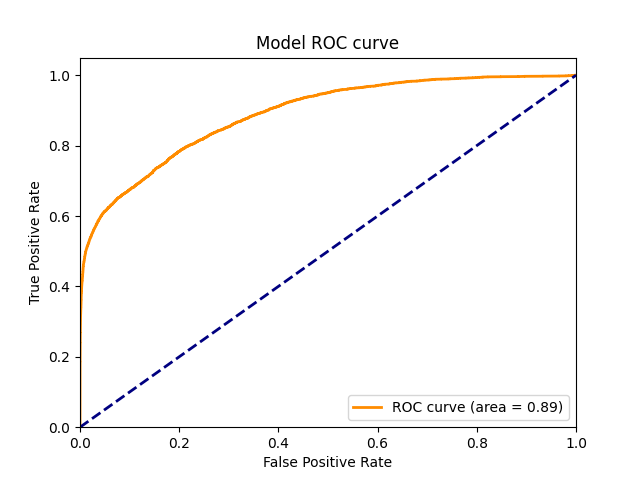
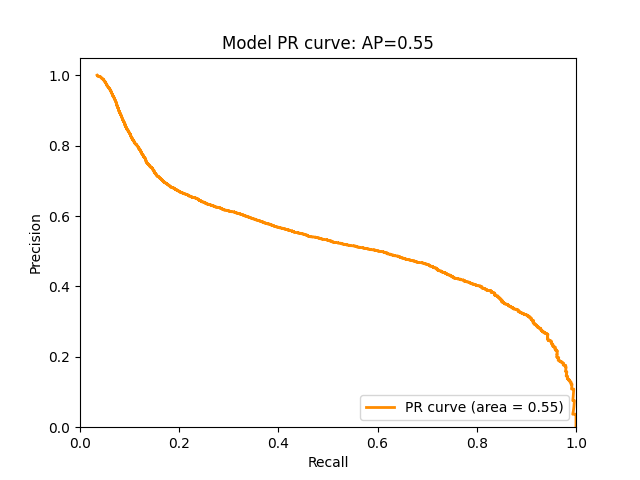

## Graph-based Fraud Detection (IEEE-CIS)

This project implements **fraud detection on transaction graphs** using **Graph Neural Networks (GNNs)** with **PyTorch** (PyTorch Geometric for heterogeneous graphs), based on the [IEEE-CIS Fraud Detection](https://www.kaggle.com/c/ieee-fraud-detection/data) dataset.

The idea is to model transactions, cards, devices, emails, IPs, etc. as nodes in a **heterogeneous graph**, connect them with edges that represent their relationships, and train a GNN to classify whether a transaction is fraudulent or not.

---

## Dataset

- **Source**: [IEEE-CIS Fraud Detection](https://www.kaggle.com/c/ieee-fraud-detection/data) on Kaggle.  
- After downloading, place all CSV files into the `ieee-data/` folder.

From these tables, the notebooks:
- Clean and merge data.
- Build node/edge features (transaction statistics, card/email/device/IP information, time-based features).
- Construct a heterogeneous graph as input to the GNN model.

---

## Project Structure

- `ieee-data/` – raw Kaggle CSV files.  
- `data/` – processed data and graph-ready artifacts.  
- `model/` – saved model checkpoints and related files.  
- `output/` – logs, numeric results and (optional) exported figures.  
- `content/` – HTML visualizations of the graph structure (schema, subgraphs, etc.).

Notebooks are executed **in order**:

1. `00_*.ipynb` – environment setup, data loading, basic EDA.  
2. `01_*.ipynb` – preprocessing and feature engineering, save processed data to `data/`.  
3. `02_*.ipynb` – graph construction and GNN training (PyTorch Geometric), save models to `model/`.  
4. `03_*.ipynb` – evaluation and visualization, export result plots to `content/`.

---

## Environment

The project can run on **Google Colab**, **Kaggle Notebooks**, or local Python:

Main libraries:
- Python 3.12.12, PyTorch 2.9.0, PyTorch Geometric  
- NumPy, pandas, scikit-learn  
- Matplotlib / Seaborn

---

## Results

Due to strong class imbalance, the focus is on **balancing precision and recall**:

- Metrics: ROC-AUC, precision, recall, F1-score, confusion matrix.  
- Logs and numeric results are stored in `output/` (e.g. `results.txt`).
- Interactive graph visualizations are stored as HTML files in `content/` 

  
  

Performance may vary depending on configuration (hyperparameters, random seed, hardware), but the project demonstrates an end-to-end **graph-based fraud detection pipeline** on a real-world dataset using modern GNN techniques.

